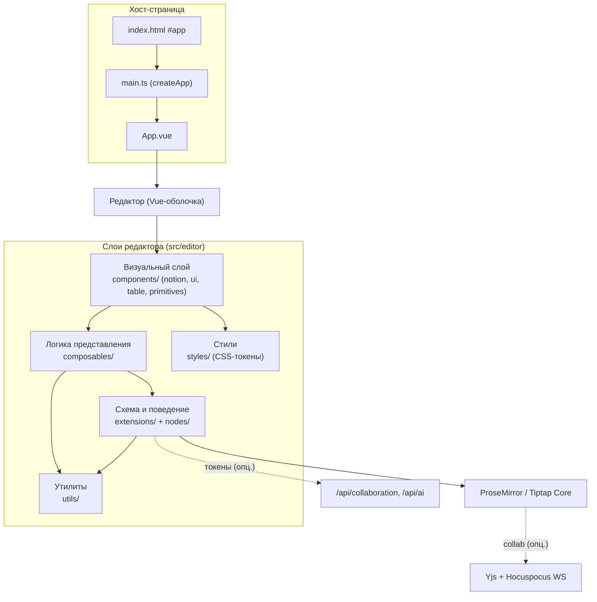
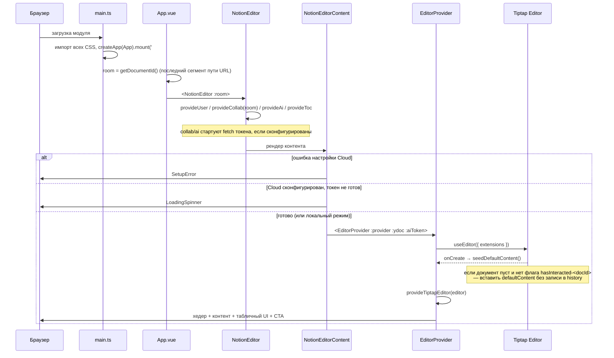
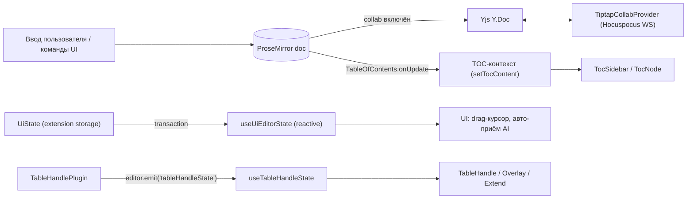
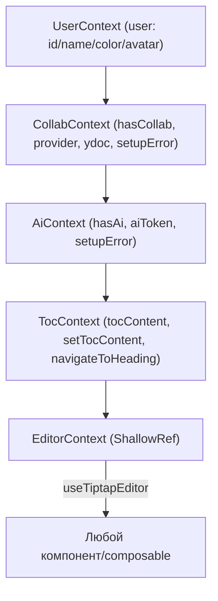
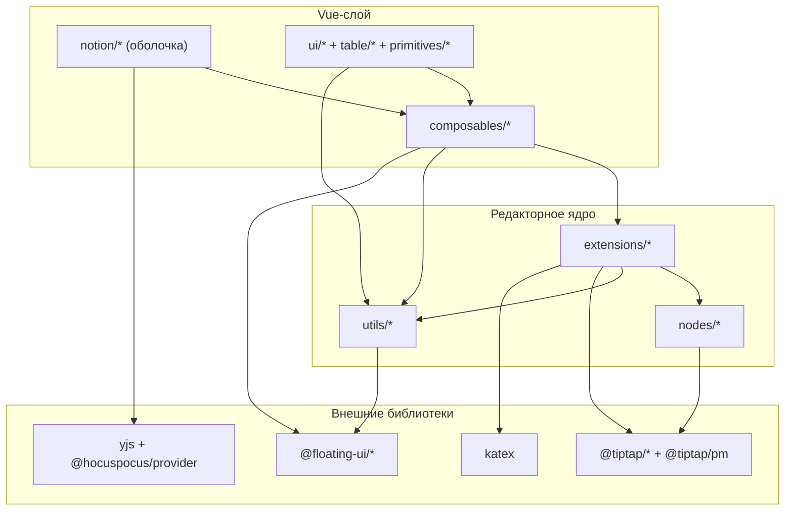

# Архитектура приложения

> Документ описывает архитектуру текущей реализации (Vue 3 + Tiptap v3),
> восстановленной из минифицированной сборки оригинального Notion-like
> редактора. Все утверждения основаны на коде в `src/`. Бизнес-логика и
> пользовательские возможности вынесены в [`DESCRIPTION.md`](./DESCRIPTION.md).

## 1. Общая архитектура

Приложение — **single-page application без роутера**: единственный экран —
Notion-подобный редактор форматированного текста. Ядро документа и все
редакторские операции обеспечивает **ProseMirror** (через Tiptap), а Vue
отвечает за оболочку, плавающие меню, панели инструментов и позиционирование
UI поверх содержимого.

Архитектура выстроена вокруг четырёх принципов:

- **Editor-centric.** Единственный источник истины о содержимом — документ
  ProseMirror. Vue-компоненты читают состояние из редактора и вызывают его
  команды, но не хранят копию контента.
- **Слоистость.** Схема/поведение (extensions, nodes, ProseMirror-плагины)
  отделены от визуального слоя (Vue-компоненты) и от вспомогательной логики
  (composables, utils).
- **Провайдеры через `provide/inject`.** React-контексты оригинала заменены
  на цепочку Vue-провайдеров (user, collab, ai, toc, editor).
- **Graceful degradation.** Облачные подсистемы (совместное редактирование,
  AI) включаются только при наличии конфигурации; без неё редактор работает
  локально.



## 2. Структура директорий

```
src/
├── main.ts                      # Точка входа: createApp, импорт всех CSS
├── App.vue                      # Корень: getDocumentId() → <NotionEditor room>
└── editor/
    ├── components/
    │   ├── notion/              # Оболочка редактора (провайдеры, хедер, layout, TOC-сайдбар, экраны)
    │   ├── ui/                  # Прикладной UI (меню, попапы, кнопки форматирования, тулбары)
    │   ├── table/              # Табличный UI (ручки, overlay выделения, extend-кнопки, меню ячеек)
    │   └── primitives/         # Переиспользуемые примитивы (Button, Popover, Menu, Tooltip, Avatar, Card…)
    ├── composables/             # Логика представления (provide/inject-контексты + хуки-обёртки над редактором)
    │   └── blocks/             # Конверсия блоков (turn-into)
    ├── extensions/              # Tiptap-расширения (схема-атрибуты, ProseMirror-плагины, команды)
    ├── nodes/                   # Кастомные ноды с Vue-NodeView (image, image-upload, toc)
    ├── content/                 # default-content.ts — стартовый документ
    ├── utils/                   # Чистые функции: таблицы, suggestion, tiptap-утилиты, документ/пользователь
    ├── icons/                   # SVG-иконки как функциональные Vue-компоненты (index.ts, ~97 шт.)
    └── styles/                  # CSS: design-tokens + постилевые файлы на каждый узел/примитив
```

Псевдоним путей: `@/*` → `src/*` (`tsconfig.json`).

## 3. Ответственность слоёв

| Слой | Директория | Ответственность |
|---|---|---|
| **Оболочка / провайдеры** | `components/notion/` | Сборка дерева провайдеров, гейт готовности, создание редактора, хедер, layout, экраны загрузки/ошибки. |
| **Прикладной UI** | `components/ui/`, `components/table/` | Плавающие меню (slash/emoji/mention), тулбары (десктоп/мобайл), попапы цвета/ссылок, drag-меню блока, табличные ручки и overlay. |
| **Примитивы** | `components/primitives/` | Базовые непривязанные к домену элементы (Button, Popover, DropdownMenu, Menu, Tooltip, Avatar, Card, Input, Toolbar, Badge, Separator, Spacer). |
| **Composables** | `composables/` | Контексты через `provide/inject` и хуки, связывающие Vue-реактивность с редактором (подписки на события/транзакции, вычисление доступности команд, позиционирование). |
| **Расширения** | `extensions/` | Схема-атрибуты, команды и ProseMirror-плагины. Определяют *поведение* редактора. |
| **Ноды** | `nodes/` | Кастомные узлы документа с Vue-NodeView (изображение, загрузка изображения, оглавление). |
| **Утилиты** | `utils/` | Чистые функции без Vue: работа с `TableMap`, suggestion-движок, идентификатор документа, генерация пользователя, throttle. |
| **Стили** | `styles/` | Дизайн-токены (CSS-переменные) и постилевые файлы; визуальная точность вынесена в CSS, не в JS. |

Направление зависимостей строго сверху вниз: `components → composables → extensions/utils`.
Расширения и утилиты не импортируют Vue-компоненты.

## 4. Дерево компонентов

```
App.vue ( room = getDocumentId() )
└─ NotionEditor.vue                 provideUser → provideCollab(room) → provideAi → provideToc
   └─ NotionEditorContent.vue       гейт готовности
      ├─ SetupError.vue             (collabSetupError || aiSetupError)
      ├─ LoadingSpinner.vue         (ожидание provider/токена)
      └─ EditorProvider.vue         useEditor(...extensions) + provideTiptapEditor
         ├─ NotionEditorHeader.vue  Spacer | Undo | Redo | ThemeToggle | CollabUsers
         ├─ .notion-like-editor-layout
         │  ├─ EditorContentArea.vue    EditorContent + меню:
         │  │   DragContextMenu, EmojiDropdownMenu, MentionDropdownMenu,
         │  │   SlashDropdownMenu, NotionToolbarFloating, MobileToolbar
         │  └─ TocSidebar.vue (:top-offset=48)
         ├─ TableExtendRowColumnButtons.vue
         ├─ TableHandle.vue
         ├─ TableSelectionOverlay.vue (:show-resize-handles)
         └─ CtaPopup.vue
```

Выпадающие меню и попапы монтируются через `<Teleport to="body">`, а к
позиции привязываются `@floating-ui/*`.

## 5. Жизненный цикл приложения



Готовность (`NotionEditorContent`) вычисляется так: если совместное
редактирование включено, но провайдер ещё не создан — ждать; если AI включён,
но токен не получен — ждать; иначе рендерить редактор. При не
сконфигурированных облачных сервисах редактор стартует сразу в локальном
режиме.

Уничтожение: `EditorProvider.onBeforeUnmount → editor.destroy()`;
`provideCollab.onBeforeUnmount → provider.destroy()`.

## 6. Поток данных

Единый документ ProseMirror — центр системы. Вокруг него организованы четыре
независимых потока.



- **Содержимое.** Все изменения проходят через транзакции ProseMirror. При
  включённом совместном редактировании документ связывается с `Y.Doc` через
  `@tiptap/extension-collaboration`, а `TiptapCollabProvider` синхронизирует
  его по вебсокету. В офлайн-режиме используется обычная история StarterKit
  (`undoRedo`); при коллаборации она отключается, т.к. историю ведёт Yjs.
- **UI-состояние.** Расширение `UiState` держит переходное UI-состояние (drag,
  стадии AI-генерации, видимость комментария) в *storage расширения*, а не в
  документе. `useUiEditorState` подписывается на `transaction` и отражает
  storage в реактивный объект Vue.
- **Оглавление.** Расширение `TableOfContents` на каждое обновление вызывает
  `setTocContent`, наполняя TOC-контекст; сайдбар и нода оглавления читают его.
- **Табличные ручки.** `TableHandlePlugin` отслеживает `mousemove/mousedown/`
  `mouseup/dragover/drop`, вычисляет активную строку/столбец и через
  `editor.emit('tableHandleState', state)` сообщает Vue. `useTableHandleState`
  подписывается на это событие; табличные компоненты позиционируются
  `@floating-ui`. Перестановка строк/столбцов выполняется командами
  `moveTableRow`/`moveTableColumn`, а drag-превью и dropcursor рисуются
  декорациями плагина.
- **Suggestion-меню.** Форк suggestion-плагина (`utils/suggestion`) отслеживает
  триггеры (`/`, `@`, `:`), а Vue-меню рендерят и позиционируют результаты.

## 7. Работа с API

Прямых обращений к бэкенду немного — только получение краткоживущих JWT для
облачных сервисов Tiptap. Всё сетевое взаимодействие изолировано в двух
composables.

| Подсистема | Endpoint (по умолчанию) | Реализация | Переменные окружения |
|---|---|---|---|
| Совместное редактирование | `POST /api/collaboration` | `useCollab.fetchCollabToken()` | `VITE_TIPTAP_COLLAB_APP_ID`, `VITE_TIPTAP_COLLAB_TOKEN_URL`, `VITE_TIPTAP_COLLAB_TOKEN`, `VITE_TIPTAP_COLLAB_DOC_PREFIX` |
| AI | `POST /api/ai` | `useAi.fetchAiToken()` | `VITE_TIPTAP_AI_APP_ID`, `VITE_TIPTAP_AI_TOKEN_URL`, `VITE_TIPTAP_AI_TOKEN` |

Логика включения:

- Подсистема считается сконфигурированной по наличию соответствующего
  `APP_ID`. Если задан статический токен — он используется без запроса;
  иначе выполняется `POST` к token-URL и берётся поле `token`.
- Отсутствие токена при сконфигурированной подсистеме → `setupError = true`
  → экран `SetupError`.
- Прочая работа с сетью — загрузка изображений (`handleImageUpload` в
  `utils/tiptap-utils`, объектные/base64-URL) и скачивание изображений
  (`useNodeActions`, `fetch` + `URL.createObjectURL`).

> Примечание: расширение Tiptap AI распространяется только через платный
> registry Tiptap Pro и **в порт не включено**. Контекст `useAi` сохраняет
> исходный интерфейс, но само AI-расширение в списке extensions отсутствует;
> AI-элементы UI скрываются проверкой `isExtensionAvailable(editor, 'ai')`.

## 8. Управление состоянием

Внешней библиотеки состояния (Pinia/Vuex) нет. Состояние распределено по
четырём хранилищам:

| Хранилище | Что хранит | Доступ |
|---|---|---|
| **Документ ProseMirror** | Контент, выделение, атрибуты узлов | Команды/транзакции Tiptap |
| **Storage расширений** | Переходное UI-состояние (`UiState`) | `useUiEditorState` |
| **Vue `provide/inject`** | Контексты user / collab / ai / toc / editor | Соответствующие `use*` |
| **`localStorage`** | Идентичность пользователя (`_tiptap_user_id/_username/_color`), флаг взаимодействия `hasInteracted-<docId>`, недавние цвета, тема (класс `dark` на `<html>`) | `utils/user-utils`, `useRecentColors`, `ThemeToggle` |
| **Yjs `Y.Doc`** (опц.) | CRDT-реплика документа при коллаборации | `@tiptap/extension-collaboration` |

Контексты образуют цепочку провайдеров:



`useTiptapEditor` отдаёт приоритет явно переданному редактору над контекстным
— это позволяет переиспользовать хуки как в детях `EditorProvider`, так и с
внешним редактором.

## 9. Маршрутизация

Клиентского роутера нет. «Маршрутизация» сводится к чтению URL:

- **Идентификатор документа** — `getDocumentId()`: последний сегмент
  `location.pathname` либо `'default'`. Используется как имя комнаты
  коллаборации и как ключ флага `hasInteracted-<docId>`.
- **Параметр `?noCollab=1`** — принудительно отключает совместное
  редактирование (`useCollab`).
- **Hash (`#<nodeId>`)** — якорные ссылки на узлы: `useScrollToHash`
  прокручивает к элементу; `useNodeActions` формирует ссылку с
  `?source=copy_link#<nodeId>`.

## 10. Ключевые архитектурные решения

| Решение | Обоснование (по коду) |
|---|---|
| ProseMirror/Tiptap как источник истины | Vue-слой без дублирования состояния; UI читает редактор и вызывает команды. |
| `provide/inject` вместо React-контекстов | Прямое соответствие оригинальной иерархии провайдеров при переносе на Vue. |
| UI-состояние в storage расширения, не в документе | Переходные флаги (drag, AI) не попадают в историю/CRDT и не синхронизируются между клиентами. |
| Связь плагин→Vue через `editor.emit` | Табличный плагин остаётся в ProseMirror-слое, а Vue лишь подписывается на события — слои не смешиваются. |
| Позиционирование через `@floating-ui` + `Teleport` | Меню и ручки живут в `body`, не искажаются overflow-контейнерами и корректно позиционируются при скролле/ресайзе. |
| Отключение `undoRedo` StarterKit при коллаборации | История при совместном редактировании ведётся Yjs; двойная история недопустима. |
| Условные extensions (collab-каретка) | `Collaboration`/`CollaborationCaret` добавляются в набор только при наличии provider — единый редактор для онлайн/офлайн. |
| Визуальная точность в CSS-токенах | Размеры/цвета вынесены в `design-tokens.css`; компоненты используют те же имена классов, что и оригинал. |
| Кастомные глобальные атрибуты (`Indent`, `NodeBackground`, `NodeAlignment`) | Отступ, фон и выравнивание применяются к множеству типов узлов через `addGlobalAttributes`, а не отдельными нодами. |

## 11. Зависимости между подсистемами



Ключевые внешние зависимости (`package.json`):

- **Tiptap v3 / ProseMirror** (`@tiptap/*`, `@tiptap/pm`) — ядро редактора,
  схема, команды, таблицы.
- **Совместное редактирование** — `yjs`, `y-prosemirror`, `y-protocols`,
  `@hocuspocus/provider`, `@tiptap/extension-collaboration(-caret)`.
- **Позиционирование** — `@floating-ui/dom`, `@floating-ui/vue`.
- **Контент-фичи** — `katex` (формулы), `@tiptap/extension-emoji`,
  `@tiptap/extension-mention`, `@tiptap/extension-table*`,
  `@tiptap/extension-*` (highlight, image, math, text-align/style, typography,
  unique-id, sub/superscript, list, toc).
- **Иконки** — локальные SVG-функциональные компоненты из `src/editor/icons`.
- **Сборка** — Vite + `@vitejs/plugin-vue`, TypeScript, `vue-tsc`.

## 12. Известные допущения и ограничения архитектуры

- **Тесты отсутствуют.** В репозитории нет ни тестового фреймворка, ни
  тест-файлов, ни соответствующих npm-скриптов.
- **`app/` и `docs/` отсутствуют.** Прежние версии этих документов ссылались
  на пути `app/src/editor/...` и каталог `docs/*` — их в проекте нет; актуальные
  исходники лежат в `src/editor/...`.
- **Схема БД / бэкенд не входят в проект.** Приложение фронтенд-only; token-URL
  предполагают внешний сервис, реализация которого здесь отсутствует.
- **Единственная точка сборки редактора** — `EditorProvider.vue`; список
  расширений задаётся статически при создании редактора.
