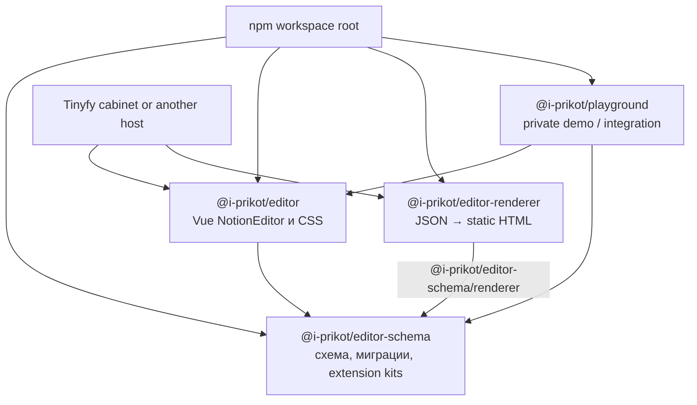
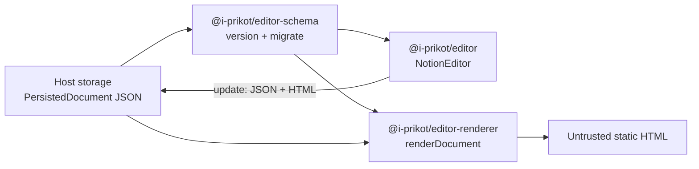

# Архитектура монорепозитория

> Этот документ описывает границы npm-workspaces, публичные контракты и
> направление зависимостей. Продуктовое назначение и выбор пакета приведены в
> [`DESCRIPTION.md`](./DESCRIPTION.md).

## 1. Архитектурный обзор

Репозиторий — npm-workspaces монорепозиторий с тремя публикуемыми библиотеками
scope `@i-prikot` и private приложением для локальной интеграции. Корневой
`package.json` координирует workspace, но не является библиотекой редактора.


```mermaid
flowchart TB
  Root["npm workspace root"]
  Schema["@i-prikot/editor-schema\nсхема, миграции, extension kits"]
  Editor["@i-prikot/editor\nVue NotionEditor и CSS"]
  Renderer["@i-prikot/editor-renderer\nJSON → static HTML"]
  Playground["@i-prikot/playground\nprivate demo / integration"]
  Host["Tinyfy cabinet or another host"]

  Root --> Schema
  Root --> Editor
  Root --> Renderer
  Root --> Playground
  Editor --> Schema
  Renderer -->|"@i-prikot/editor-schema/renderer"| Schema
  Playground --> Editor
  Playground --> Schema
  Host --> Editor
  Host --> Renderer
```

Tinyfy cabinet не находится в `apps/` и не является частью данного workspace.
Он — внешний host: выбирает способ хранения, аутентификации, тему и
инфраструктуру внешних сервисов, а пакеты предоставляют только редакторские
возможности.

## 2. Структура workspace

```text
.
├── package.json                  # workspace scripts и workspaces: packages/*, apps/*
├── packages/
│   ├── schema/                   # @i-prikot/editor-schema
│   ├── editor/                   # @i-prikot/editor
│   └── renderer/                 # @i-prikot/editor-renderer
├── apps/
│   └── playground/               # @i-prikot/playground (private)
├── test/                         # unit и integration tests
├── e2e/                          # браузерные сценарии
└── scripts/                      # release и workspace verifiers
```

Внутренние каталоги `packages/*/src` и файлы компонентов — детали реализации.
Они не являются контрактом для Tinyfy, playground или опубликованных
потребителей. Использовать следует только export map соответствующего пакета.

## 3. Пакеты и их владение

### `@i-prikot/editor-schema`

Нижний общий слой для документной модели:

- владеет `JSONContent`, версией сохранённой схемы, `createPersistedDocument`,
  `migrate` и `CURRENT_SCHEMA_VERSION`;
- предоставляет общие editor extension kits, типы и переиспользуемые
  расширения Tiptap;
- отделяет renderer-safe набор расширений от интерактивных Vue NodeView;
- не зависит от `@i-prikot/editor`, `@i-prikot/editor-renderer` или приложений.

### `@i-prikot/editor`

Интерактивная Vue-библиотека:

- экспортирует стабильный фасад `NotionEditor`, его props, события и типы;
- владеет Vue-компонентами, composables, локализованным UI, меню, таблицами,
  image NodeView и редакторским жизненным циклом;
- использует `@i-prikot/editor-schema` для схемы, расширений, типов и общих
  утилит;
- поставляет базовый editor CSS и opt-in light/dark theme CSS; host выбирает
  собственный контейнер и применяет тему через `data-tiptap-theme`.

Редакторские детали — провайдеры локализации, пользователя, collaboration, AI,
оглавления и якорной навигации — остаются внутри этого пакета. Они не меняют
владение данными: host по-прежнему владеет сохранением документа и внешними
учётными данными.

### `@i-prikot/editor-renderer`

Статический, не-Vue путь публикации:

- принимает сохранённый `JSONContent` и экспортирует `renderDocument`;
- использует только renderer-вход `@i-prikot/editor-schema/renderer`,
  `@tiptap/html`, `happy-dom` и KaTeX;
- нормализует разрешённые атрибуты, исключает editor-only ноды и отключает
  сгенерированные checkbox-поля задач;
- не импортирует и не должен импортировать `@i-prikot/editor`, Vue-компоненты,
  browser-only editor UI или его внутренние пути.

### `@i-prikot/playground`

Private Vite-приложение для локальной проверки интеграции. Оно использует
публикуемые интерфейсы `@i-prikot/editor`, `@i-prikot/editor-schema` и
stylesheet `@i-prikot/editor/styles.css`; его исходники, host header и demo
состояние не являются частью поставляемой библиотеки.

## 4. Публичные точки входа

| Пакет | Стабильные импорты | Назначение |
| --- | --- | --- |
| `@i-prikot/editor-schema` | `@i-prikot/editor-schema` | Типы документа, версия, миграции и shared editor extension kit. |
| `@i-prikot/editor-schema` | `@i-prikot/editor-schema/renderer` | Renderer-safe extension kit. |
| `@i-prikot/editor` | `@i-prikot/editor` | `NotionEditor`, публичные типы и поддерживаемые UI exports. |
| `@i-prikot/editor` | `@i-prikot/editor/style.css`, `@i-prikot/editor/styles.css`, `@i-prikot/editor/light-theme.css`, `@i-prikot/editor/dark-theme.css` | Базовые стили и opt-in темы интерактивного редактора. |
| `@i-prikot/editor-renderer` | `@i-prikot/editor-renderer` | `renderDocument` для статического HTML. |
| `@i-prikot/editor-renderer` | `@i-prikot/editor-renderer/styles.css`, `@i-prikot/editor-renderer/katex.css` | Стили опубликованного HTML и формул. |

Не поддерживаются как публичные API: `packages/schema/src/*`,
`packages/editor/src/*`, `packages/renderer/src/*`, отдельные Vue-компоненты,
composables, внутренние extension kit и файлы из `dist/` по относительным путям.

## 5. Правила зависимостей и поставка

1. `@i-prikot/editor-schema` — общий нижний слой. Пакеты выше могут зависеть
   от него, но он не может зависеть от них.
2. `@i-prikot/editor` зависит от `@i-prikot/editor-schema` и не переносит
   схему, миграции или renderer-safe наборы расширений в собственную копию.
3. `@i-prikot/editor-renderer` зависит от
   `@i-prikot/editor-schema/renderer`; импорт `@i-prikot/editor` в renderer
   запрещён.
4. `@i-prikot/playground` проверяет только опубликованные package interfaces.
   Его код не может быть зависимостью библиотек и не должен становиться
   источником production API.
5. Внешний Tinyfy host зависит от опубликованных пакетов. Ни библиотека, ни
   playground не зависят от кода кабинета Tinyfy.

Корневой `npm run build` соблюдает порядок: сначала
`@i-prikot/editor-schema`, затем `@i-prikot/editor`, затем
`@i-prikot/editor-renderer`, после чего собирается `@i-prikot/playground`.
Это порядок доставки и проверки совместимости, а не разрешение на обратные
импорты.

## 6. Документная модель и потоки

Единый сохранённый JSON-документ — граница между интерактивным и статическим
сценариями. Версия схемы и миграции принадлежат `@i-prikot/editor-schema`.


```mermaid
flowchart LR
  Store["Host storage\nPersistedDocument JSON"]
  Schema["@i-prikot/editor-schema\nversion + migrate"]
  Editor["@i-prikot/editor\nNotionEditor"]
  Renderer["@i-prikot/editor-renderer\nrenderDocument"]
  Html["Untrusted static HTML"]

  Store --> Schema
  Schema --> Editor
  Schema --> Renderer
  Editor -->|"update: JSON + HTML"| Store
  Store --> Renderer
  Renderer --> Html
```

- Интерактивный редактор получает текущий `content`, работает с ProseMirror
  транзакциями и сообщает host обновлённые JSON и HTML.
- Host сохраняет JSON и при необходимости проводит миграцию на своей границе
  хранения с API `@i-prikot/editor-schema`.
- Статический рендер не требует Vue-редактор: host передаёт сохранённый JSON в
  `renderDocument`, а затем применяет собственную политику безопасного вывода.
- HTML из `update`, `getHTML` и `renderDocument` имеет документное
  происхождение. Его необходимо считать недоверенным перед вставкой в host UI,
  даже если renderer уже нормализовал известные атрибуты.

## 7. Контракт интеграции с Tinyfy

Tinyfy использует `NotionEditor` как публичный Vue-компонент и отвечает за
следующие входные данные и решения:

| Зона | Ответственность host |
| --- | --- |
| Идентификация | Передать стабильный `documentId` и абсолютный `baseUrl`. |
| Содержимое | Передать текущий `content`, обработать обновления и хранить JSON. |
| Навигация | Управлять `currentAnchor` и сохранять полученный `anchor-change`. |
| Тема | Выбрать собственный контейнер и установить на нём `data-tiptap-theme="light"` или `data-tiptap-theme="dark"`; библиотека не ожидает глобальных эффектов на `html` или `body`. |
| Медиа | При необходимости передать `imageUpload` adapter и реализовать upload/download в собственной инфраструктуре. |
| Локализация | Выбрать `locale` и передать `messages`; пакету не нужен host i18n plugin. |
| Внешние сервисы | При необходимости сконфигурировать `collaboration` и `ai`, включая получение краткоживущих credentials. |

### Жизненный цикл интерактивного редактора

Host должен обрабатывать только поддерживаемые события:

- `ready` — экземпляр Tiptap готов;
- `update` — debounced изменение с `schemaVersion`, JSON и document-derived HTML;
- `anchor-change` — пользователь сменил активный якорь;
- `operation-error` — структурированная ошибка image-upload или image-download.

Императивный доступ допускается только через component ref и методы
`getJSON`, `getHTML`, `focus` и `setContent`. Внутренние Vue refs, editor
providers, composables и компоненты не являются альтернативным API.

### Безопасность и диагностика

Host получает краткоживущие credentials для Tiptap Cloud или других внешних
сервисов и передаёт конфигурацию в публичные props. Секреты, долгоживущие
токены и host-specific endpoints нельзя встраивать в исходники пакетов или
статическую client-конфигурацию.

`developmentDiagnostics` включается только явно для разработки. Диагностика
должна оставаться редактированной: обычные integration diagnostics и
`operation-error` не должны раскрывать host-токены, document JSON/HTML,
значения локализации или целые message catalogs.

### Отдельный путь статического рендера

Tinyfy не должен загружать интерактивный Vue-пакет только ради отображения
сохранённого документа. Для server-side, publish-time или background рендера
следует вызвать `renderDocument` из `@i-prikot/editor-renderer`, подключить
`@i-prikot/editor-renderer/styles.css` и при формулах
`@i-prikot/editor-renderer/katex.css`, после чего очистить или изолировать
результирующий HTML по политике host.

## 8. Проверочные границы

- Изменение publishable API требует обновления package export map и проверки
  использования в playground.
- Изменение схемы требует совместимой миграции сохранённых документов и
  сохранения renderer-safe пути.
- Изменение editor CSS не должно вводить глобальные селекторы: host изолирует
  экземпляры собственным контейнером, а темы выбираются атрибутом
  `data-tiptap-theme` на этом контейнере.
- Изменение collaboration, AI, media или i18n не должно добавлять секреты,
  содержимое документа или каталоги сообщений в диагностические события.
- Документация, примеры и импорты используют только scope `@i-prikot`; private
  и внутренние исходные пути не являются API для потребителей.
